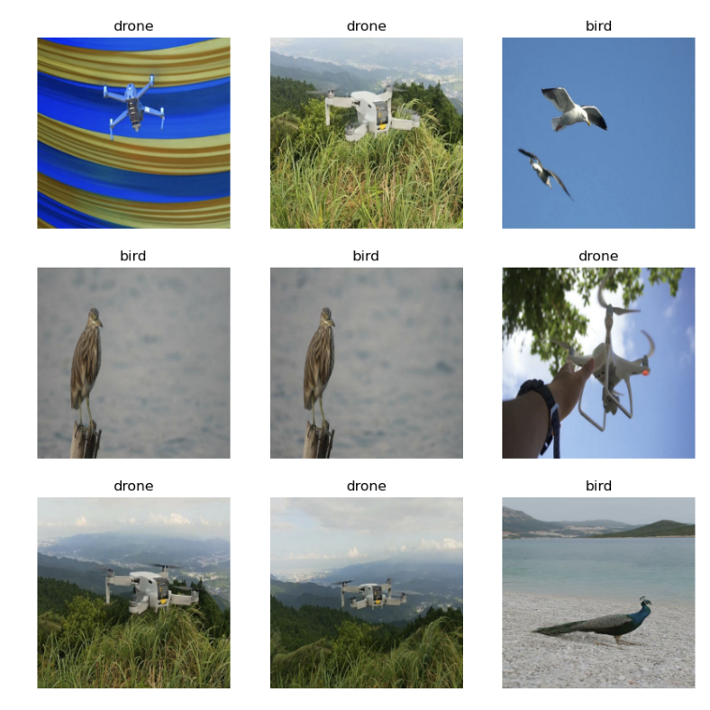

# Drone vs Bird Coding Project

This paper is part of the final project for the CS 344 Deep Learning class. The Jupyter notebook contains the models and the results.
## Abstract

The need to accurately detect and classify UAVs in real time is more important than ever—especially when false alarms caused by birds can by costly. In this project, I built and evaluated deep learning models to distinguish drones from birds using the Bird vs Drone dataset from VIT Bhopal University (with some supplemental images from Google and Unsplash). After preprocessing and restructuring the data, I trained three models: a simple CNN as a baseline, a fine-tuned ResNet50 for improved feature extraction, and a state-of-the-art Vision Transformer (ViT) via Roboflow. While the CNN and ResNet50 both struggled with overfitting and achieved modest test performance (F1 ≈ 0.47–0.48), the ViT achieved a weighted accuracy of 0.72—still highlighting the challenge of limited, clean data. The project underlines that while modern architectures can make fast, accurate predictions, robust results in real-world scenarios depend heavily on high-quality, diverse datasets that capture the full complexity of the task.

## Background

With the widespread use of Unmanned Aerial Vehicles (UAVs), also known as drones, there is a growing need to effectively detect and monitor these objects in real time to avoid possible risks associated with their use. This is where computer vision and deep learning technologies, with their speed and accuracy, come in handy. A significant body of literature covers algorithms tackling this issue.

However, there is a false positives problem – birds and other similar objects can confuse the algorithm and issue a false alarm, which is undesirable. In my project, I will detect and classify whether the object detected is a UAV.

## Dataset Preprocessing

I sourced data from the Bird vs Drone dataset from VIT Bhopal University. It includes 20,925 images, all with a resolution of 640 x 640 pixels in JPEG format. The images are sourced from videos to simulate the real-world scenario where this technology will be applied. Each image has a corresponding label in the text format, indicating its class and the bounding box. The dataset was pre-split into ~87% train, ~8% validation, and ~4% test, represented by folders. Each folder contains images of both classes and labels with corresponding filenames.

Since I load data using the Keras image_dataset_from_directory() method, I needed to reorganize the files into a different structure with folders representing class names. Conveniently, images were named according to their class, so this was achieved using a few os library commands.

When performing initial data cleaning, it came to my attention that the training data was augmented and is very different from the validation images, leading to poor performance. For that reason, I moved forward by using the majority of the validation data for training. I then discovered that the test set contained many duplicates from the validation set, which would create a data leakage problem. For that reason, I sourced 104 bird and drone images from Google and Unsplash. At the end, my split had the following distribution: 1387 images for training,  353 for validation, and 104 for testing (Figures 1-3).

Figure 1. Sample images from the training dataset sourced from VIT Bhopal University.

Figure 2. Sample images from the validation dataset sourced from VIT Bhopal University.

Figure 3. Sample images from the testing dataset sourced from Google and Unsplash. 

## Methodology: Training 

### Architecture Overview

#### Convolution Neural Network (CNN)
For training, I use advanced Convolutional Neural Networks (CNNs). CNN is a deep learning algorithm best suited for processing image data. It contains a combination of convolution and pooling layers, as well the final fully-connected layer. In each convolution layer, a feature detector, also known as a kernel or a filter, usually a 3x3 matrix, moves across the image and detects its features. Gradient descent helps determine the weight for the feature detector. The optional pooling layer then summarizes features before passing the output to other layers. The final layer of the network is a fully-connected layer that applies an activation function that classifies the image or directly outputs the final result.

#### Pretrained CNN: ResNet50

There are many pretrained CNNs. ResNet has gained popularity due to its residual block algorithm, which is built on the idea of residual blocks. They connect layers, skipping some in between, allowing the model to ignore layers that are not useful and decreasing the vanishing gradient problem, which becomes more acute as networks get deeper. I decided to use ResNet50 as it is trained on the ImageNet dataset, containing 14 million images belonging to 1000 classes. ResNet50 consists, as the name suggests, of 50 layers (Figure 4). It consists of convolutional layers followed by batch normalization and ReLU activation.  The identity block passes the input through some convolutional layers and adds the input back to the output. Thus, the network learns residual functions mapping the input to the desired output. The convolutional block is the same as the identity block except for the addition of a 1x1 convolutional layer. Finally, we have the final block that makes the final calculation using the softmax activation function. When applying the model to a more specific dataset, this block can be modified to have the desired output. One can fine-tune this model by adding more layers or retraining parts of it to predict more task-specific input.

Figure 4. ResNet50 Architecture with 50 layers and 5 stages, 4 of which combine convolution and identity blocks.

#### Vision Transformers (ViT)
While CNN-based models are still very much used, Vision Transformers (ViT) are changin the scene of computer vision. ViT is an architecture that applies transformers, the “de-facto standard” for natural language processing, to image data. It splits images into smaller fixed-size patches, allowing them to be treated like word tokens. There are many architecture details, but since I only use ViT to compare my model to the state-of-the-art, I will omit them.

Figure 5. ViT architecture.

### Model Development

#### Primitive CNN

I begin by developing a simple CNN. I will use it as a benchmark to evaluate the performance of the model using pretrained ResNet50 and then compare it to the state of the art in computer vision – ViT. The CNN is defined using the Keras Sequential class and consists of 12 layers. After resizing to 125x125 and rescaling to the 1-255 range, it sends the data through 3 convolution layers, with 200, 64, and 32 nodes, correspondingly, with a 3x3 kernel and the Rectified Linear Unit (ReLU) activation function, ending with a max pooling layer. Then follow 2 more convolution layers with 10 and 5 nodes, all with 3x3 filters and ReLU activation, and a max pooling layer at the end. Finally, after flattening the output, there is a fully-connected layer with 128 nodes and another fully-connected layer with 1 node and sigmoid activation function, outputting 0 for “Drone” and 1 for “Bird.” This architecture was guided by the general convention of layers getting smaller further into the network, without much systematic hyperparameter tuning.

To evaluate the model on validation data, I use the F1 score and the accuracy score. F1 is calculated from precision and recall, where the precision is the number of true positive results divided by the number of all samples predicted to be positive, including false positives, and the recall is the number of true positive results divided by the number of actually positive samples. The primitive CNN model has an F1 score of 0.37 and an accuracy of 0.47.

#### Fine-tuned ResNet50

To fine-tune the ResNet50 model, I first load the model from Keras applications. I do not include the “top” (the final block) and set the input_shape to be 224x224 pixels, as it is the format  ResNet50 was trained on, and save it as base_model. I freeze all the pre-trained layers except for the last block. ّI then wrap the base_model into a new Keras Sequential model, first resizing the rescaling the input for the base_model, and then using its output in the next stage of training.

To determine the best architecture for the “top” of the model, I perform a series of hyperparameter fine-tuning, evaluating performance on validation data. F1 score is my main metric, as it captures precision and recall. However, I still use the accuracy score for analysis when possible. I start by flattening the output and adding a single 1-node fully-connected layer. The first hyperparameter is the number of epochs (or iterations over the entire dataset). I set the number of epochs to 20 and plotted the accuracy over epochs (Figure 6). The point where validation accuracy diverges with higher training accuracy is where the ideal number of epochs lies. In this case, it is epoch = 8 with the accuracy of 0.75 and the F1 score of 0.49. This regularization technique, when a small number of epochs is used, is called early stopping.

Figure 6. Accuracy of the finetuned ResNet50 model on validation data over epochs. Around epoch = 8, where validation accuracy is ​​0.75, the value starts to diverge.

I then evaluate performance with an additional dense layer, testing for 10, 32, 64, 128, and 200 nodes. This results in an accuracy of 0.67 and the F1 score of 0.49 in the best performance instance, where 128 nodes are used. I then tested how dropout might influence the performance. Dropout is a regularization technique that randomly disables some nodes during training to avoid overfitting. I set the dropout rate to 0.5. I decided not to experiment with it too much, as it is a common value in deep learning algorithms. After running each model with a dropout rate of 0.5 applied to the additional dense layer, I expected to see an improvement in performance. Contrary to my hypothesis, models performed worse for all numbers of nodes. With 128 nodes, which remained the best value for this hyperparameter, the model scored 0.69 for accuracy and achieved an F1 score of 0.47. However, by definition, using dropout is a good practice when training models on a small dataset. Using the additional dense layer also yields a more consistent accuracy, with a smaller deviation across epochs (Figure 7). For that reason, I decided to stick to this architecture for the final model.

Figure 7. Validation accuracy of the fine-tuned ResNet model with an additional dense layer of 128 nodes and a 0.5 dropout rate, over epochs.

#### ViT using Roboflow

Roboflow is a web platform that uses many state-of-the-art deep learning models to aid with computer vision tasks. One such model is ViT. Roboflow allows users to upload image sets and train a ViT model on a remote machine. I use this platform to upload data, preprocess it, and train a model. Since the ViT-based model Roboflow provides uses a 640x640 image size, I apply the conversion. To keep it more consistent with the previous models, I do not apply any data augmentation. After training is complete, the model reaches the validation accuracy of 0.93 (Figure 8). Interestingly, this high accuracy was achieved early at epoch 7.

Figure 8. Validation accuracy of the ViT-based model over epochs

## Results: Model Testing

#### Testing primitive CNN

I test the model using the test set and evaluate using the F1 and accuracy scores. For the simple CNN defined and trained from scratch, we get the accuracy score of 0.50 and the F1 score of 0.47 (Figure 9). I use the Keras classification_report() method to view precision, recall, and F1 scores for each class, as well as the weighted average. The model is much more likely to guess a bird as opposed to a drone (Figure 10).

Figure 9. Classification report on test dataset for the simple CNN

Figure 10. Sample predictions on testing data of the simple CNN model

#### Testing fine-tuned ResNet50

The fine-tuned ResNet50 is not significantly better, with the accuracy of 0.50 and the F1 score of 0.48. When looking at the classification report for each class, it turns out that the model does have a better performance for drone images across all metrics when compared to the values in the simple CNN (Figure 11). Looking at sample predictions also suggests consistent patterns in predictions – the model is struggling to classify drone images where the drone is located further away (Figure 12).  

Figure 11. Classification report on test dataset for the fine-tuned ResNet50 model with an additional dense layer of 128 nodes and a 0.5 dropout rate.

Figure 12. Sample predictions on testing data made by the fine-tuned ResNet50 model with an additional dense layer of 128 nodes and a 0.5 dropout rate.

#### Testing Roboflow’s ViT

As for the ViT model developed in Roboflow, the free version does not provide a way to test the model on a batch, so I imported the model from Roboflow and manually calculated the accuracy for each class and the weighted average. The accuracy for drone images is 0.6, while the accuracy for bird images is 0.85. The weighted average for the two classes is 0.72, which is still significantly higher than the values for the CNN-based model I tested.

Figure 13. Sample predictions on testing data of Roboflow’s ViT

## Discussions

My project has a few shortcomings. One is overfitting due to the limited amount of data. Both CNN-based models had high performance while training, but much poorer performance on new data. Due to many corruptions in the original data, I had to discard most of it, thus decreasing the amount of data I can train on. While I tried augmenting the newly defined train set, I got an unknown error that led to stopping the execution of the program. I hoped that augmentation would help diversify the input and avoid overfitting. Nevertheless, residual blocks and dropout techniques proved quite useful to address the problem.

While the data is equally distributed, with the drone image count slightly larger, there is still an opportunity for bias. Due to the nature of the problem, the prediction must be done in the context where the object appears. However, especially with CNNs, some features can be learned that unintentionally were consistent across the class images, such as certain background objects, frame angles, or other irrelevant factors. On the other hand, time sequence data that can interpret some other features (e.g., how the object moves) is not present. Both make the model make decisions based on incomplete or wrong information.

Another unexpected result was the fact that in all 3 models, the model was more likely to guess the bird class than the drone class. In this situation, depending on the context of the task at hand, this caution can be an advantage. If the goal is to avoid false alarms on drones, one might want the model to report a drone only when the confidence level is high. However, if the goal is to apply the model in the context that prioritizes recall, like detecting any risk of drones, the models I developed are not ideal. 

To sum up, this project shows how deep learning algorithms can be leveraged to help software identify a drone versus a bird. There are many architectures that can achieve this relatively quickly, but the test results and performance analysis highlight the importance of a large amount of quality data that captures all factors that can influence the decision.

## References

1. Coluccia, A.,  Fascista, A., Sommer, L., Schumann, A., Dimou, A. & Zarpalas, D. (2023). The Drone-vs-Bird Detection Grand Challenge at ICASSP 2023: A Review of Methods and Results. IEEE Open Journal of Signal Processing, vol. 5, pp. 766-779, 2024. doi: 10.1109/OJSP.2024.3379073
2. Dosovitskiy, A., Beyer, L., Kolesnikov, A., Weissenborn, D., Zhai, X., Unterthiner, T., Dehghani, M., Minderer, M., Heigold, G., Gelly, S., Uszkoreit, J., & Houlsby, N. (2021). An Image is Worth 16x16 Words: Transformers for Image Recognition at Scale. International Conference on Learning Representations. https://openreview.net/pdf?id=YicbFdNTTy 
3. He, K., Zhang, X., Ren, S., & Sun, J. (2016). Deep residual learning for image recognition. In Proceedings of the IEEE conference on computer vision and pattern recognition (pp. 770-778).
4. Liu, Z., An, P., Yang, Y., Qiu, S., Liu, Q., & Xu, X. (2024). Vision-Based Drone Detection in Complex Environments: A Survey. Drones, 8(11), 643. https://doi.org/10.3390/drones8110643 
5. Shandilya, S. K., Srivastav, A., Yemets, K., Datta, A., & Nagar, A. K. (2023). YOLO-based segmented dataset for drone vs. bird detection for deep and machine learning algorithms. Data in Brief, 50, 109355. https://doi.org/10.1016/j.dib.2023.109355 

